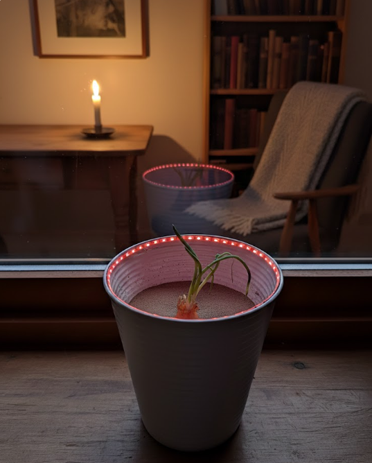
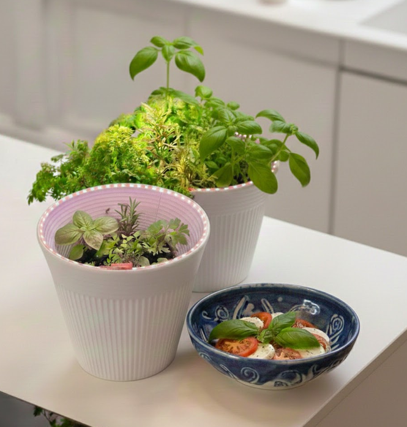

# illuminated_flowerpot

Illuminated Flowerpot is a small home project that helps herbs and vegetables grow indoors by providing gentle, configurable light. The current build focuses on simple, reliable lighting control. Configuration will be handled via a Bluetooth SPP module, and a future ESP32‑C3 Zero version is planned with a web-based configuration panel.

## Technical details

- LED type: 1‑wire addressable strip (WS2812/WS2811‑compatible), 5V
- Controller (current): Arduino Pro Mini 5V/16MHz
- Data pin: D6 (default)
- LED count: configurable (stored in EEPROM)
- Persistent settings: EEPROM

### Current functions

- Default boot: warm white at full brightness
- Serial commands to set:
	- LED count
	- RGB color and brightness
	- Profiles: warm white, plant-friendly, custom
	- Day/night timer (start/end, enable/disable)
	- Current time (for day/night switching)
- Settings survive reboot after `SAVE`

### Planned

- Bluetooth SPP configuration
- ESP32‑C3 Zero version with web configuration panel

## Build and flash (Ubuntu)

Install prerequisites:

- Arduino CLI
- AVR core and required libraries

Quick setup:

1) Install arduino-cli
2) Run:

```
arduino-cli core update-index
arduino-cli core install arduino:avr
arduino-cli lib install "Adafruit NeoPixel"
```

Build:

```
./build.sh
```

Flash (adjust port if needed):

```
PORT=/dev/ttyUSB0 ./flash.sh
```

If your Pro Mini uses the old bootloader, set:

```
FQBN=arduino:avr:pro:cpu=16MHzatmega328old ./flash.sh
```



